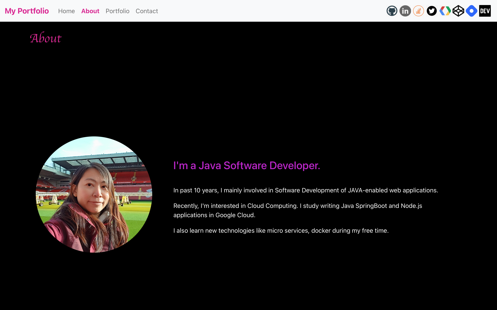
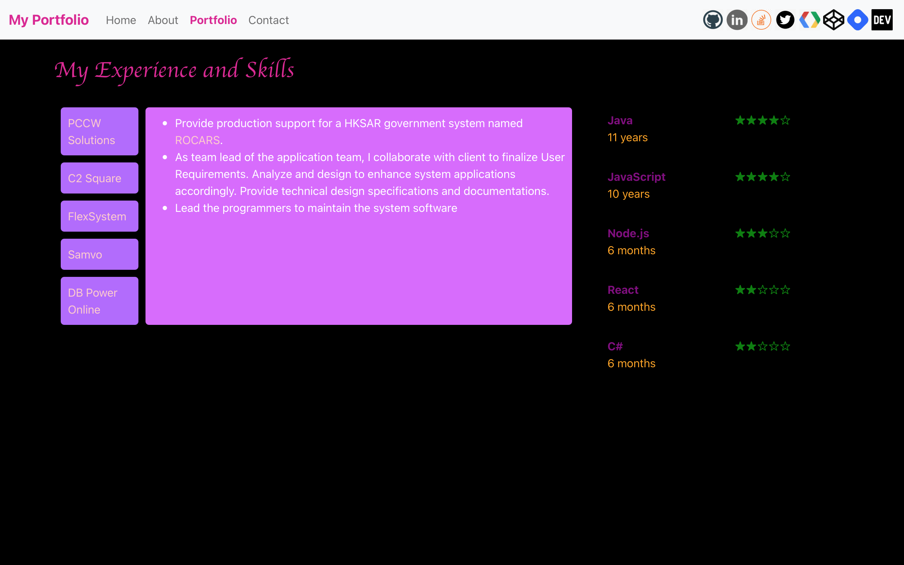
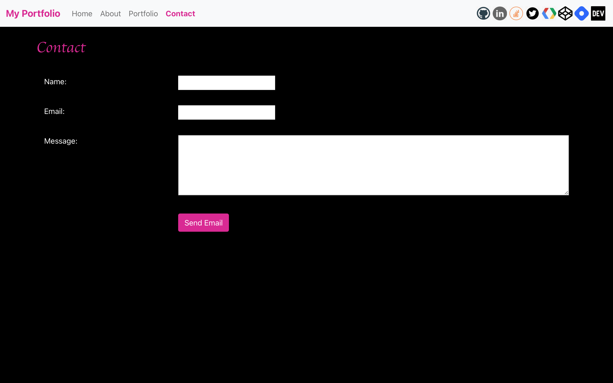

# Portfolio Web Site

> Build my Portfolio Web Site using React.








## Live Demo

Available at the following hosting platforms:
1. React application hosted at [Netlify](https://portfolio.adafycheng.dev) (custom domain can be added freely).
2. React application hosted at [Heroku](https://adacheng-portfolio-website.herokuapp.com).
3. React application hosted at [Vercel](https://portfolio-website-react-six.vercel.app) (custom domain can be added freely if not used in hashnode.dev).
4. React application hosted at <a href="https://aws-portfolio.adafycheng.dev/" target="_blank">AWS Amplify Hosting</a> (custom domain can be added).  <a href="https://aws.amazon.com/amplify/pricing/" target="_blank">Pay as you go pricing scheme</a> applies.
5. Docker image hosted at [Google Cloud Run](https://gcp-portfolio.adafycheng.dev).  Cloud Build is configured for continuous deployment.
6. Static files hosted at [GitHub Pages](https://adafycheng.github.io) freely.

Continuous Integration is configured at the first five hosting platforms above such that automatic deployment will be triggered when any file is committed into the main branch of the GitHub repository.

| Platform | CI on main | CI on PR |
| --- | :---: | :---: |
| Netlify | Yes | Yes |
| Heroku | Yes | No |
| Vercel | Yes | Yes |
| AWS Amplify | Yes | No |
| Google Cloud Run (Docker) | Yes | Yes |
| GitHub Pages | No | No |


## Development

1. Install the libraries.

    ```bash
    npm install react react-dom

    npm install -g create-react-app

    npm install bootstrap

    npm install react-bootstrap
  
    npm install jquery
   
    npm install sass
    ```

2. Create a React application.

    ```sh
    npx create-react-app portfolio-website-react
    ```
   
3. Modify source code /src/App.js.

4. Build the application.
    ```sh
    npm run build
    ```

5. Start the application locally.
    ```sh
    npm install -g serve
    serve -s build
    ```

6. Verify by opening the following URL in broswer.
    ```sh
    http://localhost:5000
    ```

## Security Scan

Before deployment, it's better to have security scan on the docker image and apply fix if any vulnerabilities found.

### 1. Docker Image

1. Build the docker image.

    ```sh
    docker build -f Dockerfile -t portfolio-website .
    ```

2. Scan the docker image.

    ```sh
    docker scan portfolio-website
    ```

## Deployment

A React application can be deployed to server via the following deployment types:
1. [Node.js application](#1-nodejs-application)
2. [Docker image](#2-docker-image)
3. [Static pages](#3-static-pages)

### 1. Node.js application

```sh
npm install
npm start
```

### 2. Docker image

1. Build the docker image.

    ```sh
    docker build -f Dockerfile -t portfolio-website .
    ```

2. Run docker image.

    ```sh
    docker run --name portfolio-website -it -p 5001:3000 -d portfolio-website
    ```

### 3. Static pages

1. Build the application.

    ```sh
    npm run build
    ```

2. Copy all the static files in the `build` folder to the web server.


## Acknowledgements

1. [Bootstrap with Create React App](https://www.npmjs.com/package/create-react-app).
2. [React component for rating](https://www.npmjs.com/package/reactjs-rating-component).
3. [React component for tabbed pane](https://www.npmjs.com/package/reactjs-tabbedpane-component).
4. [React component for top navigation bar](https://www.npmjs.com/package/reactjs-topnav-component).
5. [CI with Snyk using GitHub ](https://blog.adafycheng.dev/ci-with-snyk-using-github-actions).