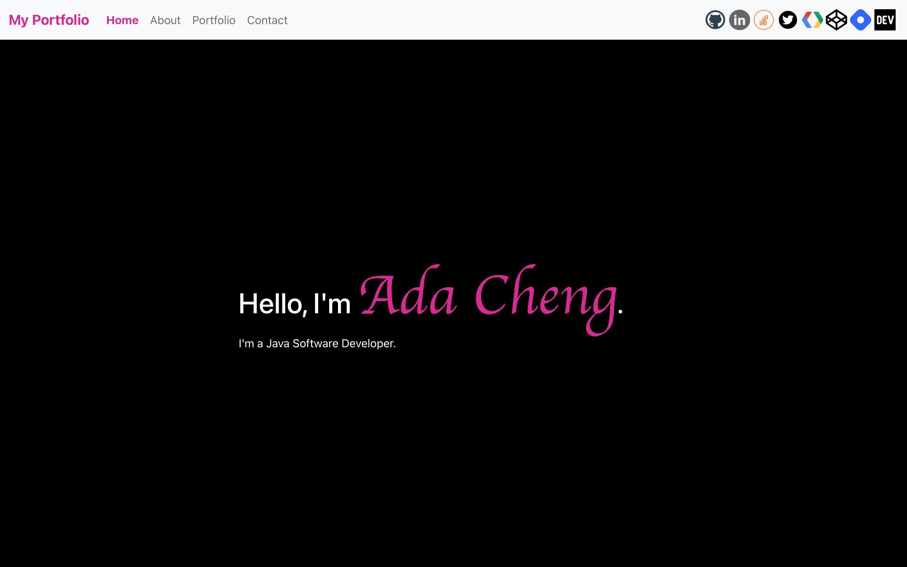

# Portfolio Web Site

> Build my Portfolio Web Site using React.




## Live Demo

Available at the following hosting platforms:
1. Node.js hosted at [Netlify](https://portfolio.adafycheng.dev) (custom domain can be added freely).
2. Node.js hosted at [Heroku](https://adacheng-portfolio-website.herokuapp.com).
3. Node.js hosted at [Vercel](https://portfolio-website-react-six.vercel.app) (custom domain can be added freely if not used in hashnode.dev).
4. Node.js hosted at <a href="https://aws-portfolio.adafycheng.dev/" target="_blank">AWS Amplify Hosting</a> (custom domain can be added).  <a href="4. Node.js hosted at <a href="https://aws-portfolio.adafycheng.dev/" target="_blank">AWS Amplify</a> (custom domain can be added).  <a href="https://aws.amazon.com/amplify/pricing/">Pay as you go pricing scheme</a> applies.
5. Docker image hosted at [Google Cloud](https://adafycheng.dev).
6. Static files hosted at [GitHub Pages](https://adafycheng.github.io) freely.

Continuous Integration is configured at the first four hosting platforms above such that automatic deployment will be triggered when any file is committed into the main branch of the GitHub repository.


## Development

1. Install the libraries.

    ```bash
    npm install react react-dom

    npm install -g create-react-app

    npm install bootstrap

    npm install react-bootstrap
  
    npm install jquery
   
    npm install sass
    ```

2. Create a React application.

    ```sh
    npx create-react-app portfolio-website-react
    ```
   
3. Modify source code /src/App.js.

4. Build the application.
    ```sh
    npm run build
    ```

5. Start the application locally.
    ```sh
    npm install -g serve
    serve -s build
    ```

6. Verify by opening the following URL in broswer.
    ```sh
    http://localhost:5000
    ```

## Deployment

A node.js application can be deployed to server via the following deployment types:
1. [Node.js application](#1-nodejs-application)
2. [Docker image](#2-docker-image)
3. [Static pages](#3-static-pages)

### 1. Node.js application

```sh
npm install
npm start
```

### 2. Docker image

1. Build the docker image.

    ```sh
    docker build -f Dockerfile -t portfolio-website .
    ```

2. Run docker image.

    ```sh
    docker run --name portfolio-website -it -p 5001:3000 -d portfolio-website
    ```

### 3. Static pages

1. Build the application.

    ```sh
    npm run build
    ```

2. Copy all the static files in the `build` folder to the web server.


## Acknowledgements

1. [Bootstrap with Create React App](https://www.npmjs.com/package/create-react-app).
2. [React component for rating](https://www.npmjs.com/package/reactjs-rating-component).
3. [React component for tabbed pane](https://www.npmjs.com/package/reactjs-tabbedpane-component).
4. [React component for top navigation bar](https://www.npmjs.com/package/reactjs-topnav-component).